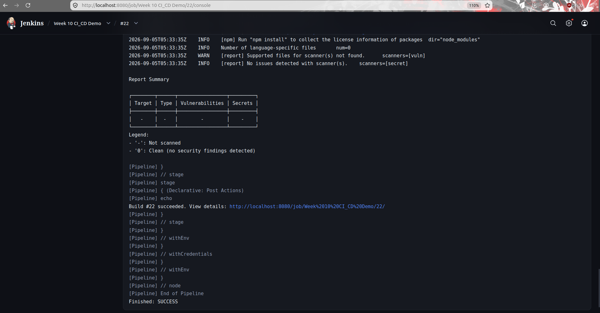
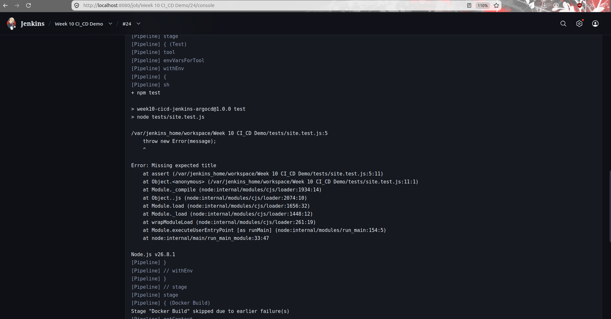
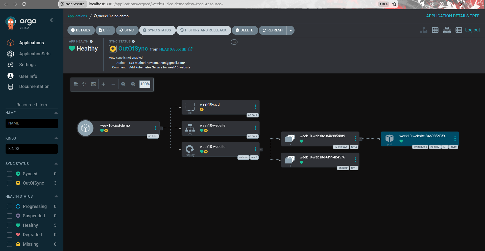
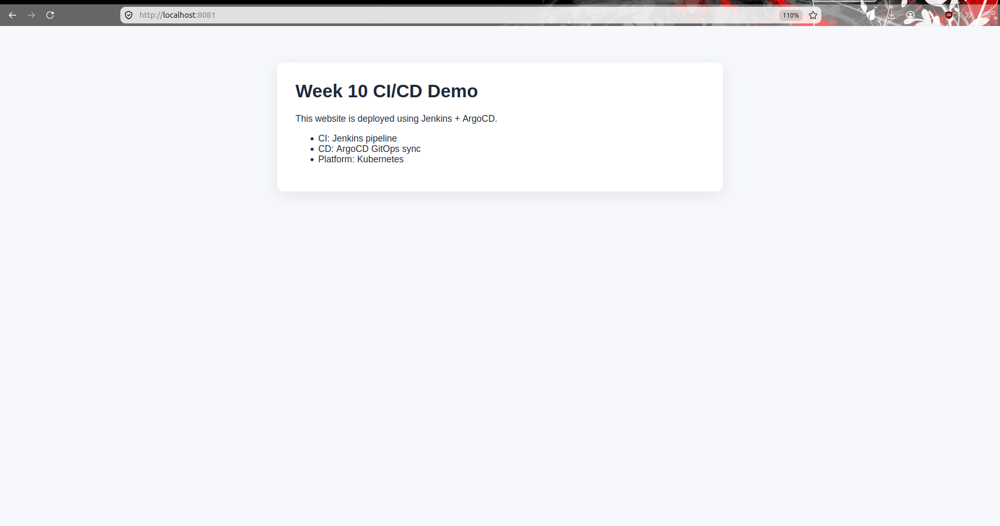
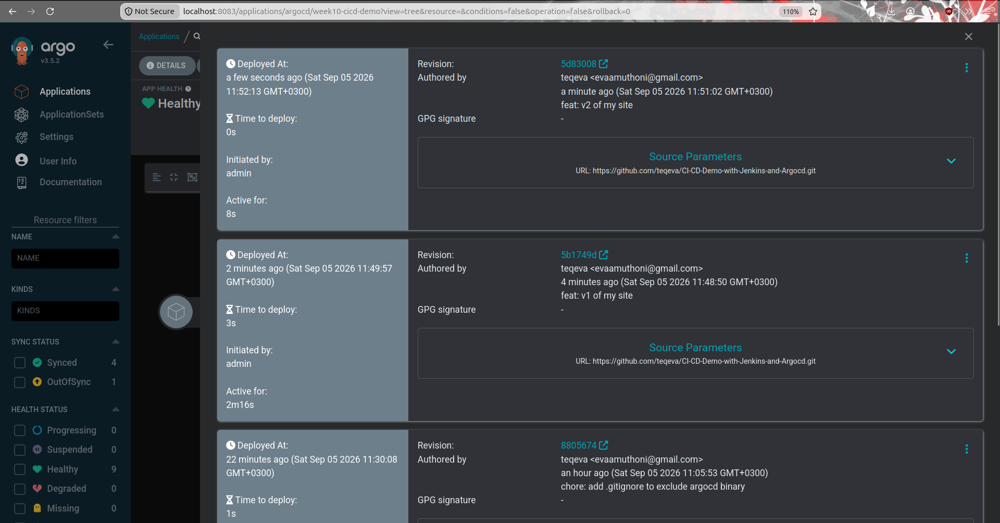
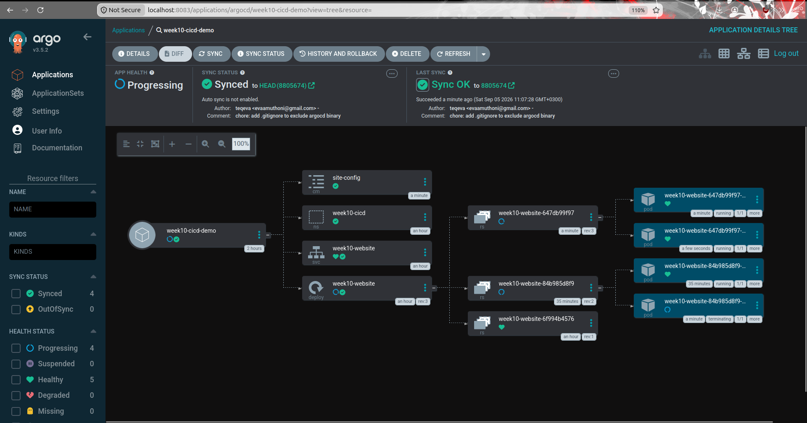
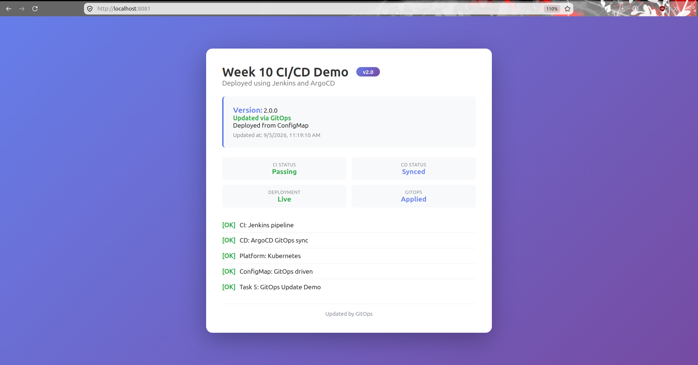

# Week 10 CI/CD Demo: Jenkins + ArgoCD

A small static website deployed through a full Git-tracked CI/CD workflow: **Jenkins** builds, tests, and pushes a Docker image; **ArgoCD** deploys it to Kubernetes using Git as the single source of truth.

---

## Purpose

This project demonstrates a complete GitOps pipeline where:

- Jenkins validates every change (install → test → build → push → scan)
- ArgoCD watches this repository and syncs Kubernetes manifests automatically
- Application configuration lives in a Kubernetes `ConfigMap`, so content updates ship purely through Git commits.
---

## Architecture Overview

```text
Developer pushes code
        │
        ▼
GitHub Repository (this repo)
        │
        ├── Jenkinsfile (CI logic)
        ├── index.html, styles.css, tests/
        ├── Dockerfile
        ├── k8s/ (namespace, deployment, service, configmap-site)
        └── argocd/application.yaml
        │
        ▼
Jenkins Pipeline
├── Checkout
├── Install (npm install)
├── Test (npm test)
├── Docker Build
├── Docker Push  → Docker Hub (teqiee/week10-cicd-jenkins-argocd)
└── Security Scan (Trivy)
        │
        ▼
ArgoCD watches k8s/ on GitHub
        │
        ▼
Kubernetes namespace: week10-cicd
├── ConfigMap  (site-config/page content)
├── Deployment (week10-website/runs the Docker image, mounts ConfigMap)
└── Service    (NodePort 30080)
```

---

## Prerequisites

- Docker
- A Kubernetes cluster (minikube, kind, or similar) with `kubectl` configured
- Jenkins (this project ran it via the official Docker image)
- ArgoCD installed on the cluster
- A Docker Hub account for pushing images
- Node.js (used inside the Jenkins pipeline via the NodeJS plugin, not required locally unless running tests manually)

---

## Jenkins Setup

1. Install the **NodeJS plugin** and configure a tool named `node` under **Manage Jenkins → Tools**.
2. Add credentials under **Manage Jenkins → Credentials**:
   - `dockerhub-credentials` - Username/Password type, using a Docker Hub access token as the password.
3. Create a new **Pipeline** job.
4. Under **Pipeline → Definition**, choose **Pipeline script from SCM**, set SCM to **Git**, and point it at this repository's URL and `main` branch.
5. Leave the script path as `Jenkinsfile` (it lives in the repo root).
6. Ensure the Jenkins agent/container has `docker` and `trivy` available (the official Jenkins image needs `libatomic1` installed for Node to run, and Trivy installed via its official install script rather than the apt repo, which has a signing-key issue as of this writing).
7. Save, then run the job with **Build Now**.

The pipeline runs: **Checkout → Install → Test → Docker Build → Docker Push → Security Scan (Trivy)**.

---

## ArgoCD Setup

1. Install ArgoCD on your cluster if it isn't already:
   ```bash
   kubectl create namespace argocd
   kubectl apply -n argocd -f https://raw.githubusercontent.com/argoproj/argo-cd/stable/manifests/install.yaml
   ```
2. Apply the Application manifest from this repo:
   ```bash
   kubectl apply -f argocd/application.yaml
   ```
3. Access the ArgoCD UI:
   ```bash
   kubectl port-forward svc/argocd-server -n argocd 8080:443
   ```
4. Log in (`admin` / initial password from the `argocd-initial-admin-secret` secret) and open the **week10-cicd-demo** application.
5. Click **Sync → Synchronize** to apply changes from the `k8s/` folder.

---

## How ArgoCD Sync Works in This Project

- ArgoCD's Application object (`argocd/application.yaml`) watches the `k8s/` path on the `main` branch of this repository.
- On sync, it applies `namespace.yaml`, `deployment.yaml`, `service.yaml`, and `configmap-site.yaml` to the `week10-cicd` namespace.
- The website's HTML/CSS content is stored entirely in `k8s/configmap-site.yaml` and mounted into the running pod via a `subPath` volume mount. Editing that file, committing, and syncing is how content updates ship.
- Because the mount uses `subPath`, Kubernetes does **not** hot-reload the file automatically when the ConfigMap changes; a `kubectl rollout restart deployment/week10-website -n week10-cicd` is needed to pick up new content.

---
## Running Tests Locally
 
The test suite is a plain Node script.
 
1. **Clone the repo and move into it:**
```bash
   git clone https://github.com/teqeva/CI-CD-Demo-with-Jenkins-and-Argocd.git
   cd CI-CD-Demo-with-Jenkins-and-Argocd
```
2. **Install dependencies:**
```bash
   npm install
```
   This project has no runtime dependencies, so this mainly writes `node_modules/` and confirms `package.json` is valid. It's still required because `npm test` reads its script definition from `package.json`.
   
3. **Run the tests:**
```bash
   npm test
```
   Under the hood this runs `node tests/site.test.js`, which:
   - reads `index.html` from disk
   - asserts it contains `<title>Week 10 CI/CD Demo</title>`
   - asserts it contains the text `Jenkins + ArgoCD`
   - asserts it contains the word `Kubernetes`

4. **Expected output on success:**
```text
   > week10-cicd-jenkins-argocd@1.0.0 test
   > node tests/site.test.js
 
   All tests passed.
```
---
 
## Triggering the Jenkins Pipeline
   - Open Jenkins → the `Week 10 CI_CD Demo` job.
   - Click **Build Now** in the left sidebar.
   - Watch progress under **Console Output** for live logs.      
---
 
## How ArgoCD Sync Works in This Project
 
ArgoCD's core model is: **the Application object continuously compares what's declared in Git against what's actually running in the cluster, and reconciles the difference.** 
Here's exactly how that plays out in this project:
 
1. **What ArgoCD watches:** `argocd/application.yaml` defines the Application `week10-cicd-demo`, pointing `spec.source.repoURL` at this GitHub repo, `spec.source.targetRevision` at `main`, and `spec.source.path` at `k8s/`. 
2. **Refresh:** ArgoCD polls the Git repo on a default interval (roughly every 3 minutes) to check for new commits.
3. **Detecting drift:** when ArgoCD sees the live commit hash on `main` differs from what it last synced, it computes a diff between the manifests in `k8s/` at that new commit and the actual live objects in the `week10-cicd` namespace. If they differ, the app's **Sync Status** flips from `Synced` to `OutOfSync`.
4. **Sync policy in this project:** `syncPolicy` in `application.yaml` is set , meaning **sync is automated**, ArgoCD will act on its own to apply the new manifests. 
5. **What gets applied on sync:** ArgoCD runs the equivalent of `kubectl apply` for every manifest in `k8s/`: `namespace.yaml`, `deployment.yaml`, `service.yaml`, and `configmap-site.yaml` - against the `week10-cicd` namespace declared.
6. **Health vs Sync status are separate concepts:** `Synced` only means "the live objects match Git." `Healthy` is Kubernetes' own assessment of whether those objects are actually working (e.g. the Deployment has the desired number of Ready pods).
7. **The GitOps update path specifically:** the website's content lives entirely inside `k8s/configmap-site.yaml` as inline `data.index.html`. To ship a content change: edit that file → commit → push → ArgoCD detects the new revision → Sync applies the updated ConfigMap object to the cluster.
8. **The one manual step ArgoCD can't do for you here:** because `deployment.yaml` mounts the ConfigMap using `subPath`, Kubernetes does not automatically propagate ConfigMap changes into the already-running pod's filesystem (this is a `subPath`-specific limitation, not a general ConfigMap one). After a sync updates the ConfigMap, the pod needs an explicit restart to pick up the new content:
```bash
   kubectl rollout restart deployment/week10-website -n week10-cicd
```
 
9. **Verifying a sync actually happened:** the **History and Rollback** tab in the ArgoCD UI lists every sync as a separate entry, each tagged with the Git revision hash and commit message it deployed. A genuine new content update will show as a new entry with a different revision hash than the previous one.
---
Verifying a sync actually happened: the History and Rollback tab in the ArgoCD UI lists every sync as a separate entry, each tagged with the Git revision hash and commit message it deployed.

## SCREENSHOTS WITH CAPTIONS
---

1.  
   
| `docs/screenshots/01.0-jenkins-success.png` | Jenkins pipeline completing all stages successfully

---

2.  
| `docs/screenshots/02-jenkins-failure.png` | Jenkins pipeline failing at the Test stage after an intentional test break 

---

3. 
   
| `docs/screenshots/03.0-argocd-synced.png` | ArgoCD application showing `Synced` + `Healthy` status 

---

4. 
| `docs/screenshots/04.0-argocd-history.png` | ArgoCD sync history showing a new deployment triggered by a Git commit 

5. 
   
| `docs/screenshots/05.1-argocd-after-changes.png` | Deployment of v2 of the site with updated replicas as 3

---

## Repository

[https://github.com/teqeva/CI-CD-Demo-with-Jenkins-and-Argocd](https://github.com/teqeva/CI-CD-Demo-with-Jenkins-and-Argocd)

---

## Troubleshooting Notes & Lessons Learned

- **`libatomic.so.1` missing on the Jenkins agent** — the official Jenkins Docker image doesn't ship this library, but Node.js needs it. Fixed by shelling into the container as root (`docker exec -u root -it <container> bash`) and running `apt-get install -y libatomic1`. For a permanent fix, this should live in a custom Jenkins image via a `Dockerfile` extending `jenkins/jenkins:lts`, since the fix disappears if the container is recreated.
---
- **Trivy install via apt failing** — the Aqua Security apt repo had a broken/unverifiable signing key at the time of this project. Installed Trivy directly via its official install script instead of apt.
---
- **`.gitignore` accidentally excluding required project files** — a starter `.gitignore` template listed `Dockerfile`, `Jenkinsfile`, `k8s/`, and `argocd/`, all of which this project explicitly requires to be committed. Removed those entries.
---
